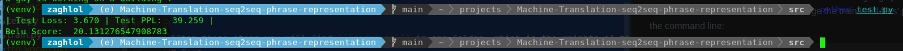

# Machine-Translation-seq2seq-phrase-representation
This repo is a pytorch implementation of [Learning Phrase Representations using RNN Encoder–Decoder
for Statistical Machine Translation](https://arxiv.org/abs/1406.1078) on [Multi30k](https://metatext.io/datasets/multi30k) dataset using De->En pair language, 
the algorithm achieved 20.30 Belu-score.

# Setup And Inference
Code is developed under following library dependencies
```commandline
python 3.7
torch 1.10.1
torchtext 0.11.1
```
Start with creating a virtual environment then open your terminal and follow the following steps:
```commandline
git clone "https://github.com/zaghlol94/Machine-Translation-seq2seq-phrase-representation"
cd Machine-Translation-seq2seq-phrase-representation
pip install -r requirements.txt
bash download_assets.sh
cd src
python inference.py -s "your sentence"
```
# Data-Set
Multi30k Dataset of paired with sentences in English and German. the [data-set](https://github.com/zaghlol94/Machine-Translation-seq2seq-phrase-representation/tree/main/data-set) folder contains: 
```commandline
    ├── test_2016_flickr.de
    ├── test_2016_flickr.en
    ├── train.de
    ├── train.en
    ├── val.de
    └── val.en
```
There are two files of training, validation, and testing data. For each German line in train.de there is a corresponding line in train.en that represents the English translation.

# Train
To train the model on custom data-set of different language pair, you could add your data files in the same structure in the [data-set](https://github.com/zaghlol94/Machine-Translation-Seq2Seq/tree/main/data-set) folder and 
change the train/valid files' path in [config.py](https://github.com/zaghlol94/Machine-Translation-seq2seq-phrase-representation/blob/main/src/config.py)
then follow the following steps in the command line:
```commandline
cd src
python train.py
```
After these steps you will find ```model.pt``` in src folder, which is the weights of the seq2sq model.
# Test
To test your model and print out the Belu-score, loss on the testing data, change the path of ```model_path```, ```src_test``` 
and ```trg_test``` in the [config.py](https://github.com/zaghlol94/Machine-Translation-seq2seq-phrase-representation/blob/main/src/config.py), Then follow the following steps
```commandline
cd src
python test.py
```


# Citation
```commandline
@misc{https://doi.org/10.48550/arxiv.1406.1078,
  doi = {10.48550/ARXIV.1406.1078},
  
  url = {https://arxiv.org/abs/1406.1078},
  
  author = {Cho, Kyunghyun and van Merrienboer, Bart and Gulcehre, Caglar and Bahdanau, Dzmitry and Bougares, Fethi and Schwenk, Holger and Bengio, Yoshua},
  
  keywords = {Computation and Language (cs.CL), Machine Learning (cs.LG), Neural and Evolutionary Computing (cs.NE), Machine Learning (stat.ML), FOS: Computer and information sciences, FOS: Computer and information sciences},
  
  title = {Learning Phrase Representations using RNN Encoder-Decoder for Statistical Machine Translation},
  
  publisher = {arXiv},
  
  year = {2014},
  
  copyright = {arXiv.org perpetual, non-exclusive license}
}
```
